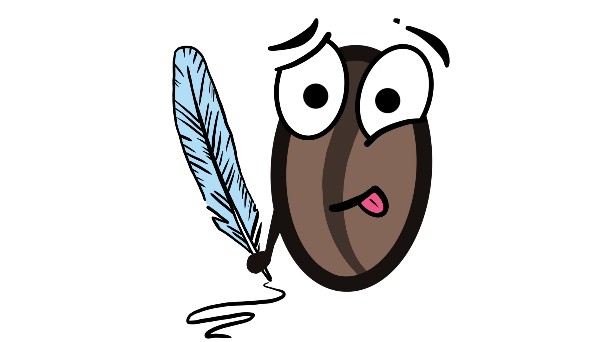

# [COFFEE TABLE SOLUTIONS NO. 2](https://www.amazon.de/Why-does-Neural-Network-learn-ebook/dp/B09QRGWWZP){:target="\_blank"}

## [Why is my Neural Network not beautiful?](https://www.amazon.de/Why-does-Neural-Network-learn-ebook/dp/B09QRGWWZP){:target="\_blank"}

We're super happy to announce that we just published the new volume. [Grab your copy here](https://www.amazon.de/Why-does-Neural-Network-learn-ebook/dp/B09QRGWWZP){:target="\_blank"}.

---

You missed the first volume? Don't worry. It's still available.   [COFFEE TABLE SOLUTIONS NO. 1: Why does my Neural Network not learn?](https://www.amazon.de/Why-does-Neural-Network-learn-ebook/dp/B09QRGWWZP){:target="\_blank"}

---

### Do we serve the coffee you are looking for?

In the world of machine learning, we often find inspiration in unexpected places. Just as the art of brewing the perfect cup of coffee has its secrets, so too does the art of crafting elegant and effective machine learning models. Welcome to the second volume in our series of coffee table solutions, where we bring you the symphony of Machine Learning Design Patterns and the pursuit of making your neural networks beautiful.
This book has a different flavor than the first. Think of its chapters as a gallery of ideas, our approach is to inspire, to elevate your existing understanding of machine learning design patterns so you can make your neural network design more beautiful. We assume you've already taken your first sips of this complex brew, perhaps by reading the first volume in the series, or by training a neural network on your own. You've had moments of awe and frustration, much like an artist working on a challenging painting. This book is here to deepen your appreciation, empower you with design patterns, and help you create neural networks and machine learning systems that are not only functional but beautifully architected and designed.

---

  <!-- Mark Schutera -->
  

    
  

  

    
Mark Schutera

    
Author

    

      
      
    

  

  <!-- Stefanie Schutera -->
  

    
  

  

    
Stefanie Schutera

    
Editor and Illustrator

    

      
      
    

  

---

© 2024 - All rights reserved. Schutera. 
[Impressum & Privacy Policy](./impressum-and-privacy-policy.html){:target="\_blank"}
